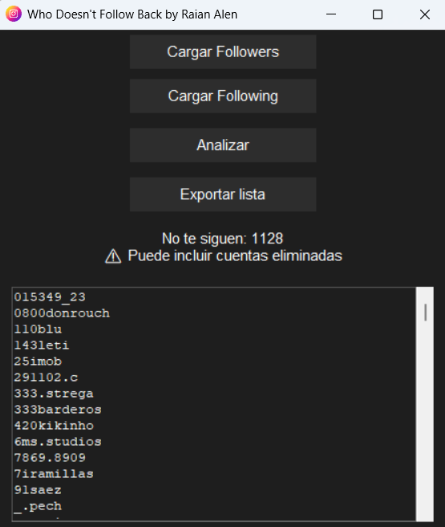

# 🚀 ¿Quién no te sigue?

## 📸 Preview




Aplicación de escritorio desarrollada en Python que permite analizar los datos descargados de Instagram y detectar qué usuarios no te siguen de vuelta.

Este proyecto fue creado como práctica real de desarrollo, trabajando con procesamiento de datos, archivos JSON y construcción de interfaces gráficas.

---

## 📌 Funcionalidades

* 📂 Cargar múltiples archivos de seguidores (followers)
* 📂 Cargar archivo de seguidos (following)
* 🔍 Comparar ambos datos automáticamente
* 📋 Mostrar resultados en una interfaz con scroll
* 💾 Exportar resultados a archivo `.txt`
* ⚠️ Manejo de casos reales (cuentas eliminadas o desactivadas)

---

## 🧠 ¿Cómo funciona?

Instagram permite descargar tus datos, incluyendo:

* Lista de seguidores
* Lista de seguidos

La aplicación:

1. Lee los archivos JSON
2. Extrae los nombres de usuario
3. Compara ambas listas
4. Muestra los usuarios que seguís pero no te siguen

> Nota: Algunos resultados pueden incluir cuentas eliminadas o desactivadas.

---

## 🛠️ Tecnologías utilizadas

* Python 3
* Tkinter (interfaz gráfica)
* JSON
* Estructuras de datos (sets)

---

## ▶️ Cómo usar

1. Descargá tus datos de Instagram:

   * Ir a: **Perfil → Menú (☰) → Centro de cuentas → Tu información y permisos → Exportar tu información**
   * Seleccionar tu cuenta
   * Elegir **"Extraer al dispositivo"**
   * En **Personalizar información**, seleccionar: *"Seguidores y seguidos"*
   * En **Intervalo de fecha**, podés elegir *"Desde el principio"*
   * En **Formato**, seleccionar **JSON**
   * En **Calidad del contenido**, elegir **Calidad más baja**

2. Descargarás un archivo `.zip` con tu información.

3. Extraer el archivo `.zip`.

4. Ubicar los siguientes archivos dentro de la carpeta extraída:

   * `followers_*.json`
   * `following.json`

5. Ejecutar la aplicación:

```bash
python main.py
```

6. Dentro de la app:

   * Cargar archivos de followers
   * Cargar archivo de following
   * Analizar
   * Exportar resultados

---

## ⚠️ Limitaciones

* Instagram no ofrece una API pública para validar usuarios
* Algunos resultados pueden corresponder a cuentas eliminadas

---

## 👨‍💻 Autor

Raian Alen

---

# 🇬🇧 English

## 🚀 Who Doesn't Follow Back

A desktop application built with Python that analyzes Instagram data to find users who don’t follow you back.

---

## 📌 Features

* Load multiple followers files
* Load following file
* Compare both datasets
* Display results in a scrollable UI
* Export results to `.txt`
* Handles real-world inconsistencies

---

## 🧠 How it works

The app processes Instagram JSON data and compares followers vs following using efficient set operations.

---

## ▶️ How to Use

1. Download your Instagram data:

   * Go to: **Profile → Menu (☰) → Accounts Center → Your Information and Permissions → Download Your Information**
   * Select your account
   * Choose **"Download to device"**
   * Under **Customize information**, select: *"Followers and following"*
   * For **Date range**, choose *"All time"* (recommended)
   * For **Format**, select **JSON**
   * For **Media quality**, choose **Lowest quality**

2. You will receive a `.zip` file containing your data.

3. Extract the `.zip` file.

4. Locate the following files:

   * `followers_*.json`
   * `following.json`

5. Run the application:

```bash
python main.py
```

6. Inside the app:

   * Load followers files
   * Load following file
   * Analyze
   * Export results

## ⚠️ Notes

Some users may appear due to deleted or deactivated accounts.


